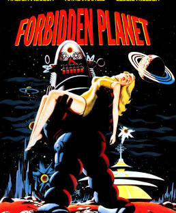

Welcome to **Synth Clarity**, a digital garden curated to explore the groundbreaking innovations of the 1956 masterpiece, *Forbidden Planet*. This site is a "Neural Network" designed to map the deep-space connections between 1950's experimental-ism and the modern Sci-Fi landscape.

The *synthesizer* and other electronic components were used to create the eerie sound effects for Forbidden Planet by the Barron brothers. It was the birth of synthesized sounds used in science fiction. That is where out story begins...

## Revolutionary Vision of the Future

When *Forbidden Planet* premiered in 1956, it was unlike anything audiences had ever seen. Hollywood’s first big-budget science fiction film shot in color and CinemaScope, it blended Shakespearean drama — loosely based on *The Tempest* — with futuristic technology, philosophical depth, and dazzling visual effects. The movie’s serious approach to science fiction helped elevate the genre from the realm of pulp serials and monster flicks into something intellectually and artistically ambitious.

## Science Fiction Aesthetic Birth

The film’s production design set a new standard. The sleek starship **C-57D**, the semi-military uniforms of its crew, and the function-driven interiors established an aesthetic language that would echo across decades of film and television. Its technical realism and respect for procedure — the way the crew operated their craft as professionals — offered a blueprint for the “speculative realism” later perfected by *Star Trek* and *2001: A Space Odyssey*.

Even **Robby the Robot**, an engineering marvel in both design and storytelling, became a pop culture icon. Robby’s logical yet personable demeanor anticipated the androids and artificial intelligence that would populate science fiction in the years to come.

## The Monster From The Id

Beyond its visuals, *Forbidden Planet* delved into psychological and moral territory rare for its era. The “monster from the id,” a manifestation of unconscious human desires run wild through alien technology, represented a sophisticated fusion of Freudian theory and speculative storytelling. This focus on inner conflict as much as external adventure shaped later science fiction that sought to explore humanity’s own flaws rather than simple outer threats.

## A Blueprint for *Star Trek*

Gene Roddenberry, creator of *Star Trek*, often cited *Forbidden Planet* as a key influence. The parallels are striking:

- A starship crew traveling to distant worlds under a disciplined command structure.
- A charismatic captain leading a quasi-military but exploratory mission.
- Encounters that explore morality, psychology, and the human condition through speculative technology.

Even the shipboard banter and the mix of curiosity, humor, and professionalism in the crew feel directly descended from the C-57D. While *Star Trek* would go further in its utopian vision and social allegory, *Forbidden Planet* opened the door for science fiction to ask big questions with seriousness and style.

## A Legacy That Still Resonates

Nearly seven decades later, *Forbidden Planet* remains a cornerstone of cinematic science fiction. Its fusion of myth, technology, and psychology paved the way not only for *Star Trek* but for a lineage of thoughtful sci-fi—from *The Twilight Zone* to *Interstellar*. It taught audiences to expect more from the genre: that outer space could be a mirror for the inner self.

As much as we think of the Enterprise boldly going where no one has gone before, it’s fair to say *Forbidden Planet* charted the course first.

---
<figure>
   <figcaption>Promotional poster from <strong>Forbidden Planet</strong></figcaption>
</figure>

---
## Synth Clarity: Artists, Gear, & Lineage

> "In every civilization there is a point where the physical meets the spiritual. On Altair IV, that point was found by the *Krell*."
---

# 🛰️ The Three Pillars

## 🧪 [[Artists]]
The pioneers who dared to tread where man was not meant to go. 
*   **The Barrons:** Discover the DIY genius of **Bebe and Louis Barron**, the couple who bypassed the orchestra to create "Electronic Tonalities."
*   **The Novelist:** Explore the work of **W.J. Stuart** (Philip MacDonald), whose 1956 novelization reveals the [[Missing Scenes]] too controversial for the silver screen.
*   **The Directors & Designers:** The visionaries at MGM who built the first world set entirely on another planet.

## 🎛️ [[Gear]]
The "Great Machine" of the Krell wasn't just on screen—it was in the studio.
*   **Living Circuits:** Understanding the homemade, self-destructing vacuum tube circuits used to capture the sound of "dying" electronics.
*   **Tape Manipulation:** How tape loops, delay, and reversed speeds birthed a new language for cinema.
*   **Robby the Robot:** A look at the most expensive "prop" in movie history and its functional AI legacy.

## 🧬 [[Lineage]]
The echo of Altair IV across the decades.
*   **Star Trek Origins:** Commander Adams was the blueprint for **Captain Kirk**. We map the direct links from the C-57D to the USS Enterprise.
*   **Sonic Successors:** From the synthesizers of **Rush** and **Pink Floyd** to the legendary sound design of **Ben Burtt** and *Star Wars*.
*   **The Id Monster Legacy:** How the concept of "Monsters from the Id" redefined the psychological thriller.

---

## 🧠 Navigate the Id
This site is built as a **Digital Garden**. Use the interactive **Neural Graph** in the sidebar to see how these topics physically intersect. Every note is a circuit; every link is a spark.

*Proceed with caution—the Krell secrets are vast...*